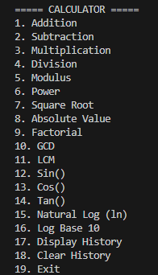
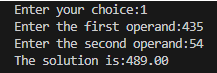
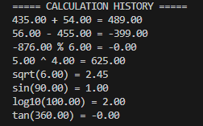

# 🧮 C Calculator

A menu-driven calculator program written in C that performs basic arithmetic, advanced mathematical operations, and maintains a history of calculations.

## ✨ Features

- ➕ Addition
- ➖ Subtraction
- ✖️ Multiplication
- ➗ Division
- `%` Modulus
- 🔢 Power calculation
- √ Square root
- 📐 Trigonometric functions
- 📊 Logarithmic functions
- 📜 Calculation history
- 🔁 Menu-driven interface
- ⚠️ Handles invalid operations such as division by zero

## 📸 Screenshots

### 🏠 Main Menu


### 🧮 Calculation Output


### 📜 Calculation History


## 🛠️ Technologies Used

- **C** — Core programming language
- **Standard C Libraries** — Input/output and mathematical operations
- **`math.h`** — Power, square root, logarithmic, and trigonometric functions

## ▶️ How to Run

### 1. Clone the repository

```bash
git clone https://github.com/jeenal0712/c-programming-practice.git
```

### 2. Navigate to the project directory

```
cd calculator
```

### 3. Compile the program

```
gcc calculator.c -o calculator -lm
```

### 4. Run the program

#### Windows:
```
calculator.exe
```

#### Linux/macOS:
```
./calculator
```

## 🧠 What I Learned

While building this project, I practiced:

- Using functions to organize code
- Working with user input and output
- Using `switch` statements for menu-driven programs
- Using loops for repeated calculations
- Using the `math.h` library for advanced mathematical operations
- Working with file handling to store and retrieve calculation history
- Reading from and writing to files
- Handling invalid input and division by zero

## 👨‍💻 Author

**Jeenal**

This project was created as part of my journey to learn and practice C programming.
