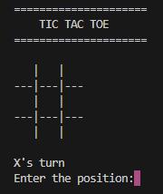
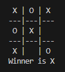
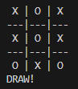

# 🎮 Tic-Tac-Toe in C

A simple command-line Tic-Tac-Toe game developed in C.

## 📌 About the Project

This project is a simple two-player Tic-Tac-Toe game built using the C programming language. It allows two players to take turns and checks for a winner or a draw after each move.

## ✨ Features

- 🎮 Two-player gameplay
- 🔄 Alternating player turns
- 🏆 Winner detection
- 🤝 Draw detection
- ✅ Input validation

## 🛠️ Concepts Used

- 2D Arrays
- Functions
- Loops
- Conditional Statements
- Recursion
- Input Validation

## 🎮 How to Play

- Player 1 uses `X`.
- Player 2 uses `O`.
- Players take turns entering a position from `1` to `9`.

### Board Positions

```text
 1 | 2 | 3
-----------
 4 | 5 | 6
-----------
 7 | 8 | 9
```

## ▶️ How to Run

Compile the program using a C compiler:

```bash
gcc Tic_Tac_Toe.c -o Tic_Tac_Toe
```
### Run the program:
```
./Tic_Tac_Toe
```

## 📸 Screenshot

### Game Start



### Winner



### Draw



### Replay


## 📚 Learning Purpose

This project helped me practice combining multiple C programming concepts to build a complete interactive console-based application.

---

⭐ More C programming projects coming soon!
